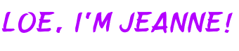
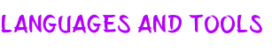
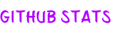

<picture>

</picture>

  
  

### Wanna know more about me? 
A computer engineering graduate at Pamantasan ng Lungsod ng Maynila, and I am an aspiring UI/UX Designer and/or Frontend Developer.

I would love to contribute to designing a functional website that are user-centered, and accessible to everyone, embracing diversity.

I am not yet that good, but I am constantly evolving. 🌱  
  

   

- 🌱 I’m currently learning JavaScript and React  
  

- 💬 You can talk to me about the dream I have for doggos/cattos for hours.  
  

- ⚡ Fun fact: I love playing guitar but does not have one ;>  
  

   

<picture>

</picture>  

 

  
  
  
  
  
  
  
  
  
  
  

  

   
 

<picture>

</picture>  

<table><tr><td valign="top" width="50%">

</td><td valign="top" width="50%">

</td></tr></table>  

   

  

   

  

   

            

 

----
